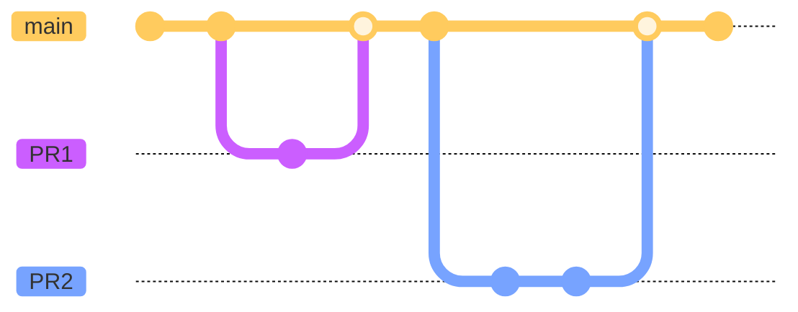
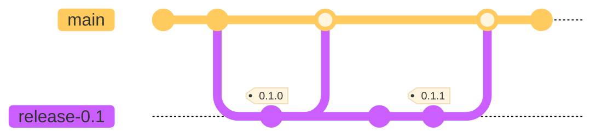
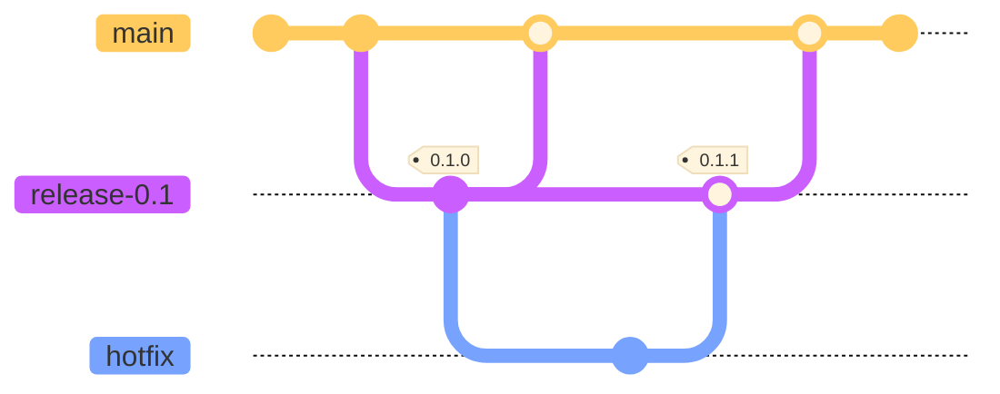
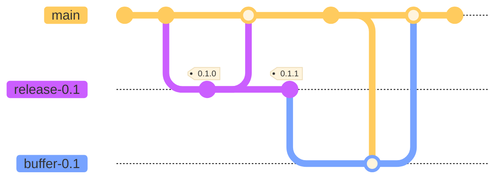

# ブランチ戦略

VOICEVOXのエディタ・エンジン・コア・リソースなどのリポジトリで取られているブランチ戦略を紹介します。
一言でいうと、リリースブランチ付きのGitHub Flowです。

## プルリクエスト（≒featureブランチ）

プルリクエストは任意のタイミングでmainブランチから派生して、mainブランチにマージします。
mainにマージする際はsquashマージします。

## releaseブランチ

マイナーバージョンごとにreleaseブランチを作成し、パッチバージョン更新時はそのreleaseブランチにコミットし、タグを打ちます。
バージョン更新後にreleaseブランチをmainにマージします。
releaseブランチをmainにマージする際はsquashせずにマージします。

リリースに関しては[リリース戦略](./リリース戦略.md)を参照してください。

### hotfixプルリクエスト

リリース済みの機能に問題があった場合は、releaseブランチから派生して、releaseブランチに向けてhotfix用のプルリクエストを作成します。

### releaseブランチをmainブランチにマージするときにコンフリクトが発生する場合

releaseブランチからbufferブランチを作成し、mainブランチをbufferブランチにマージしてから、bufferブランチをmainブランチにマージします。
このときの2回のマージは両方ともsquashせずにマージします。

## その他

過去の議論は[こちら](https://github.com/VOICEVOX/voicevox/issues/147#issuecomment-903853290)にあります。

